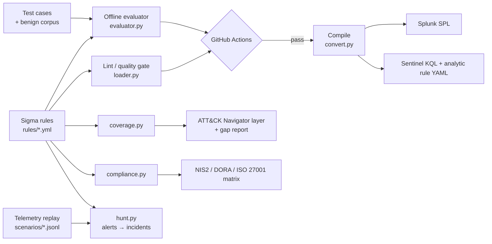

# DetectForge — Detection-as-Code for a Modern SOC

> Write detections like software: **Sigma rules → automated tests → CI → SIEM-ready content → ATT&CK coverage → compliance traceability.**
> Built by a computing graduate (SC-200, ISO 27001 Lead Auditor) to show the full detection-engineering lifecycle, not just "I installed a SIEM".

   

## Why this exists

Most SOCs fail on **detection quality**, not tooling: untested rules, alert fatigue, no idea what they can/can't detect, and no link
between security monitoring and regulation. In Ireland/EU that last point matters — **NIS2** and **DORA** now require demonstrable
detection and incident-handling capability. DetectForge tackles all four problems in one small, readable codebase.

| Problem in real SOCs | What DetectForge does |
|---|---|
| Rules pushed to prod untested | Every rule needs **true-positive + benign unit tests**; CI blocks merges that fail |
| Alert fatigue | Replays a **benign corpus** on every commit — any new false positive fails the build |
| "What can we actually detect?" | Generates an **ATT&CK Navigator layer** + gap report vs a priority technique list |
| Vendor lock-in | Vendor-neutral **Sigma** compiled to **Splunk SPL**, **Sentinel KQL** and **Sentinel analytics-rule YAML** |
| Isolated alerts, no story | **Correlation engine** groups alerts per host into a kill-chain **incident** with a risk score |
| SOC ↔ GRC disconnect | **Traceability matrix**: each detection → NIS2 / DORA / ISO 27001:2022 controls |

## Architecture



## Quick start

```bash
git clone <your-repo> && cd detectforge
pip install -r requirements.txt

python -m detectforge validate     # lint gate: ATT&CK tags, UUID, false-positive guidance, tests exist
python -m detectforge test         # TP/FP unit tests + 300-event benign corpus
python -m detectforge coverage     # out/COVERAGE.md + out/attack_layer.json (load in ATT&CK Navigator)
python -m detectforge convert      # out/splunk, out/kql, out/sentinel
python -m detectforge compliance   # out/TRACEABILITY.md
python -m detectforge hunt data/scenarios/ransomware_chain.jsonl
pytest -q                          # 31 tests
```

### Demo output (`hunt`)

```
=== INCIDENT 1: host WS-042 | risk score 95 | MULTI-STAGE INTRUSION ===
kill chain: initial_access -> execution -> persistence -> defense_evasion -> credential_access -> command_and_control -> impact
  09:04:02  [HIGH    ] Office Application Spawning Script Interpreter or Shell  (T1566.001, T1204.002)
  09:04:03  [HIGH    ] Suspicious Encoded PowerShell Command  (T1059.001, T1027)
  09:09:15  [HIGH    ] Certutil Used to Download or Decode Payloads  (T1105, T1140)
  09:14:20  [CRITICAL] LSASS Memory Dump via comsvcs.dll MiniDump  (T1003.001)
  09:31:10  [CRITICAL] Shadow Copy / Backup Deletion (Ransomware Precursor)  (T1490)
  >> RECOMMENDED: isolate host, reset user creds, preserve memory image, start IR runbook
```

## Detection library (13 rules)

Phishing macro → encoded PowerShell → certutil download → scheduled-task persistence → LSASS dump → Defender tamper →
shadow-copy deletion → log clearing, plus Linux reverse-shell and curl|bash droppers. Each rule documents **false positives**
and maps to MITRE ATT&CK. See `out/COVERAGE.md` for the current gap list (currently 15/28 priority techniques, 53%).

## Writing a new detection (the workflow)

1. Copy a file in `rules/`, change the logic, tags, `falsepositives`.
2. Add `tests/data/<rule>.json` with `should_match` and `should_not_match` events.
3. `python -m detectforge validate && python -m detectforge test` — fix until green.
4. Push → CI lints, tests, compiles, and publishes SIEM content as a build artifact.
5. Validate against the real technique using [Atomic Red Team](https://github.com/redcanaryco/atomic-red-team) in your lab (see `docs/TWO_WEEK_PLAN.md`).

## Design decisions & limitations (read this — it's honest)

* **The offline evaluator supports a Sigma subset** (field modifiers, wildcards, and/or/not, `1 of`/`all of`). Aggregations (`count`, `near`) raise `NotImplementedError` instead of silently passing.
* **Sample telemetry is synthetic** (hand-written, modelled on Sysmon EID 1 / process creation). Real-world FP rates need real data — the Atomic Red Team lab validates true positives; production tuning needs your own logs.
* **KQL output assumes a `SysmonProcessCreate` parser function** in your Sentinel workspace (configurable in `convert.py`). Field mapping between Sysmon and ASIM/Defender tables would be done with a pySigma processing pipeline.
* Compliance mapping is **indicative**, for portfolio/education use, not legal advice.
* All samples use documentation IP ranges (RFC 5737); no real malware is included.

## Roadmap

Brute-force / password-spray (aggregation rules), Entra ID sign-in detections, Sigma→Elastic, Atomic Red Team automated purple-team runner, Sentinel deployment via GitHub Action, MISP/OpenCTI IOC enrichment.

## License
MIT
